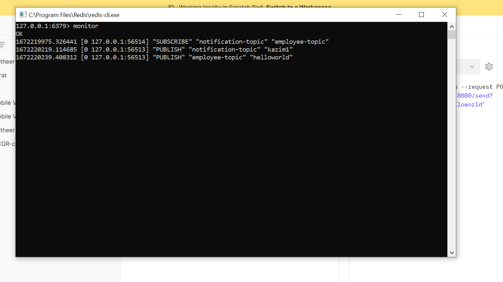

## Spring Boot - Redis Pub/Sub

-----------------------------------------------------

- Create 2 topics in the RedisConfig.java class "employee-topic" , "notification-topic"  

#### Publish message to `employee-topic`

    curl --location --request POST 'localhost:8080/send?message=helloworld'

#### Publish message to `notification-topic`

    curl --location --request POST 'localhost:8080/notify?message=kazim1'

- Run redis-cli.exe
- Enter 'monitor' command
- See the log on the redis-cli and SpringBoot application

